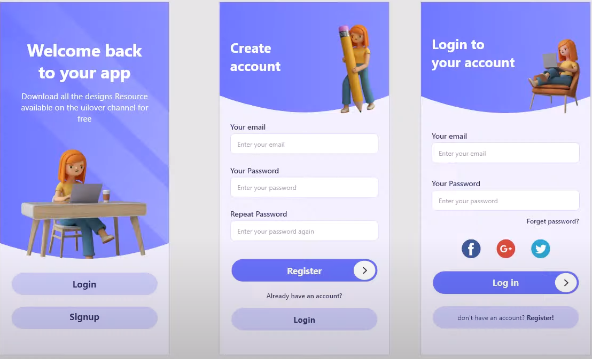

# Flutter_Design_Login_Register_28


## 🎨 Proje Açıklaması

Bu proje, Flutter ile oluşturulmuş modern bir **Login / Register** tasarımı örneğidir.  
Kullanıcı giriş ve kayıt sayfaları sade ve kullanıcı dostu bir arayüz ile tasarlanmıştır.

Proje üç ana sayfadan oluşur:
- **Entrance Page** – Giriş ekranı (Login veya Signup sayfasına yönlendirir)
- **Login Page** – Kullanıcı giriş ekranı
- **Signup Page** – Kullanıcı kayıt ekranı

---

## 📂 Dosya Yapısı

```
lib/
│
├── entrance.dart      # Giriş ekranı
├── login.dart         # Login ekranı
├── signup.dart        # Signup ekranı
└── main.dart          # Route yönetimi ve uygulama girişi
```

---

## ⚙️ main.dart

```dart
import 'entrance.dart';
import 'login.dart';
import 'signup.dart';
import 'package:flutter/material.dart';

void main() {
  runApp(const MainApp());
}

class MainApp extends StatelessWidget {
  const MainApp({super.key});

  @override
  Widget build(BuildContext context) {
    return MaterialApp(
      debugShowCheckedModeBanner: false,
      home: EntrancePage(),
      routes: {
        '/login': (context) => LoginPage(),
        '/signup': (context) => SignUpPage(),
      },
    );
  }
}
```

---

## 🧭 Navigasyon Yapısı

Sayfalar arası geçiş **Navigator.pushNamed** yöntemiyle yapılmaktadır.  
Örneğin, giriş sayfasında “Login” butonuna tıklanınca:

```dart
FilledButton(
  onPressed: () {
    Navigator.pushNamed(context, '/login');
  },
  child: Text("Login"),
)
```

Benzer şekilde, diğer butonlar da ilgili sayfalara yönlendirilir.

---

## ✏️ TextField Kullanımı

```dart
TextField(
  decoration: InputDecoration(
    filled: true,
    fillColor: const Color.fromARGB(255, 255, 255, 255),
    border: OutlineInputBorder(
      borderRadius: BorderRadius.circular(12),
      borderSide: BorderSide(
        color: Colors.grey.withValues(alpha: 0.2),
        width: 1.0,
      ),
    ),
    enabledBorder: OutlineInputBorder(
      borderRadius: BorderRadius.circular(12),
      borderSide: BorderSide(
        color: Colors.grey.withAlpha(120),
        width: 1.0,
      ),
    ),
    focusedBorder: OutlineInputBorder(
      borderRadius: BorderRadius.circular(12),
      borderSide: BorderSide(
        color: Color.fromARGB(255, 231, 236, 241).withValues(alpha: 0.7),
        width: 2.0,
      ),
    ),
    hintText: 'Enter your password',
    hintStyle: TextStyle(
      color: Colors.black.withAlpha(120),
    ),
    contentPadding: const EdgeInsets.symmetric(
      horizontal: 16,
      vertical: 12,
    ),
  ),
  style: const TextStyle(
    color: Colors.black,
    fontSize: 16,
  ),
  onChanged: (text) {
    // Metin değiştiğinde yapılacak işlemler
  },
),
```

---

## 🔘 FilledButton Kullanımı

```dart
FilledButton(
  onPressed: () {
    Navigator.pushNamed(context, '/login');
  },
  style: FilledButton.styleFrom(
    backgroundColor: const Color.fromARGB(255, 195, 194, 235),
    foregroundColor: Colors.black,
    minimumSize: const Size(double.infinity, 60),
    shape: RoundedRectangleBorder(
      borderRadius: BorderRadius.circular(30),
    ),
  ),
  child: Text(
    'Login',
    style: TextStyle(
      color: Colors.black.withValues(alpha: 0.7),
      fontSize: 22,
      fontWeight: FontWeight.w900,
      height: 1.3,
    ),
  ),
),
```

---

## 🖼️ Assets (Resimler)

Aşağıdaki resimler `assets/images` klasöründe bulunmalıdır:

```
assets/
└── images/
    ├── background_intro.png
    ├── circle.png
    ├── facebook.png
    ├── google.png
    ├── top_background.png
    ├── twitter.png
    ├── white_line.png
    ├── women.png
    ├── women1.png
    └── women2.png
```

---

## 🧩 pubspec.yaml Ayarları

```yaml
flutter:
  uses-material-design: true
  assets:
    - assets/images/
```

---

## 💡 Özellikler

- Modern arayüz tasarımı  
- Sayfalar arası geçiş sistemi  
- Responsive yapı  
- Görsel odaklı kullanıcı deneyimi  

---

## 🧠 Notlar

Bu proje temel Flutter UI tasarımına örnektir.  
Bu proje Mobil Programlama dersinde öğrencilere anlatılırken geliştirilmiş bir projedir. Tasarım ve resimler YouTube @UiLover kanalındaki bir videoda paylaşılan belgelerdir. Tasarım Flutter ile uygulanmıştır. (This project was developed during a Mobile Programming lesson. The design and images are documents shared in a video on the YouTube channel @UiLover. The design was implemented with Flutter.)

---

## 📸 Ekran Görüntüsü


